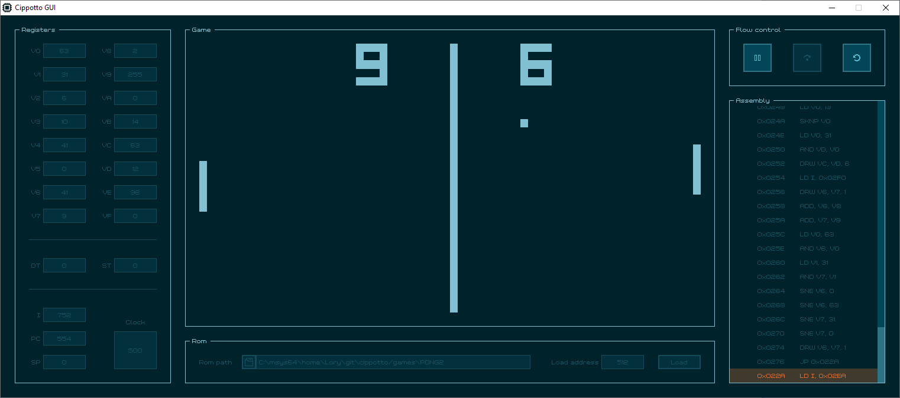
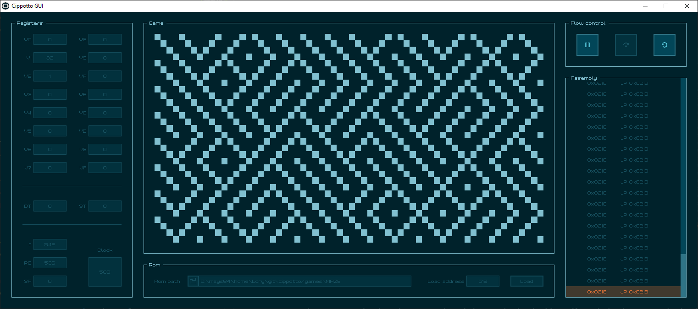
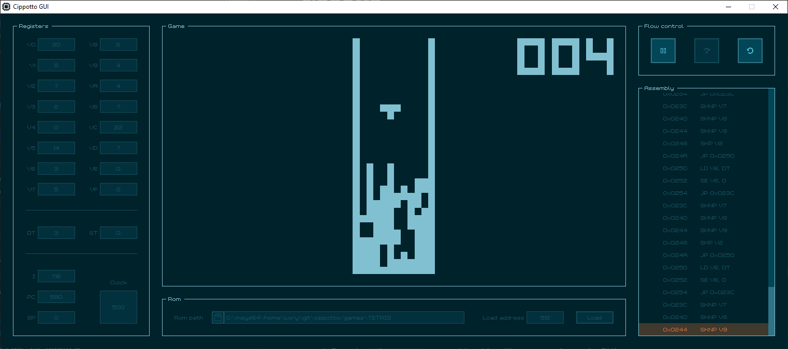
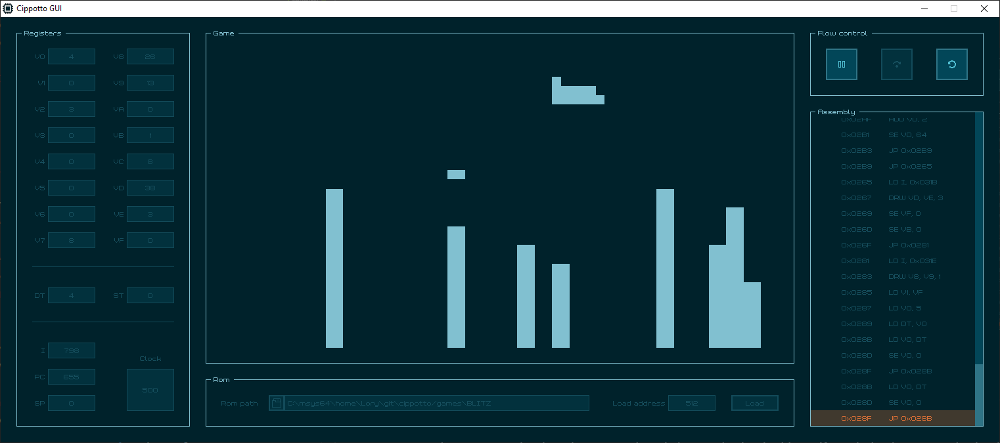
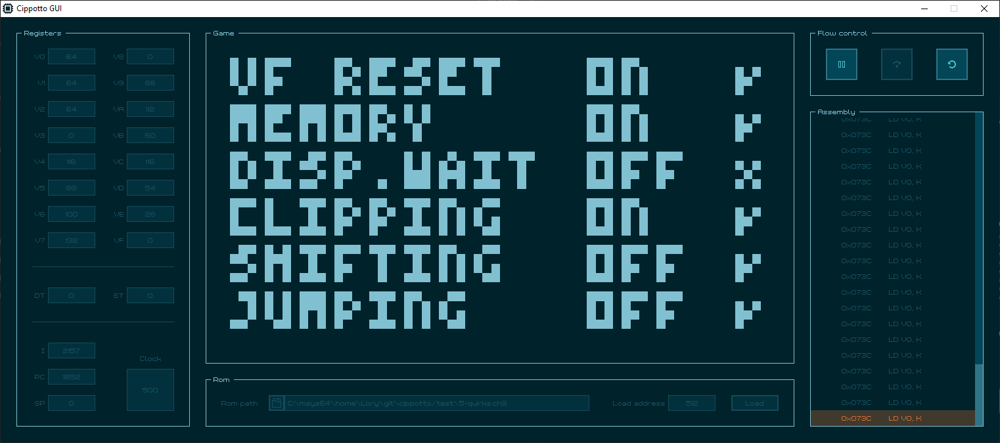

# cippotto

Chip-8 interpreter with real-time debugging and register editing capabilities.


## Usage

1. Run the `cippotto` executable: this will open up the main *GUI*.
2. In the **Rom** panel, select the *rom path* and change the *load address* (if needed). Then press the *load* button.
3. In the **Flow control** panel press the *play* button to start program execution. The program can also be paused, run instruction per instruction, or reset.
4. In the **Registers** panel, all *general purpose registers*, *timer registers*, and *special registers* are updated in real-time when the program is running and can be edited when the program is paused.
5. In the **Assembly** panel, the decoded instructions from the *rom* can be inspected. The instruction highlighted at the bottom is the next to be executed by the interpreter.

### Command line options

```
Usage: ./cippotto [options]
Options:
    -h, --help         Print this message and exit.
    -r, --rom <file>   Specify Chip-8 ROM file path.
    -a, --addr <NNN>   Specify 12-bit ROM loading address.
                       If both -r and -a are specified the ROM is pre-loaded.
    -s, --start        Start game automatically upon loading.
```

**Disclamer**: ROMs are not provided with this repo, but can be easily downloaded [here](https://archive.org/details/chip-8-games).

## Build using make

*Cippotto* is written in the C language and uses [raylib](https://www.raylib.com/) for creating the GUI. You can follow the installation steps of *raylib* for your operating system at the following [GitHub repository](https://github.com/raysan5/raylib). After making *raylib* available at system level, you can just run *make* to build the application:

```bash
make all
```

The built executable can then be found in the *bin/* folder:

```bash
./bin/cippotto
```

**Disclamer**: *Cippotto* has been built and tested successfully on *Windows (MinGW)* and *GNU/Linux*.

## Screenshots

| [Pong](https://github.com/badlogic/chip8/blob/master/roms/pong2.rom) | [Maze](https://github.com/badlogic/chip8/blob/master/roms/maze.rom) |
| :---: | :---: |
|  |  |

| [Tetris](https://github.com/badlogic/chip8/blob/master/roms/tetris.rom) | [Blitz](https://github.com/badlogic/chip8/blob/master/roms/blitz.rom) |
| :---: | :---: |
|  |  |

## Known limitations

* **Quirks**: Only the following pure Chip-8 *quirks* are supported:

    
    \**Test roms can be found at the following [GitHub repository](https://github.com/Timendus/chip8-test-suite)*.

* **Display wait**: Sprites are drawn on the screen without waiting for the vertical blank interrupt.

* **Sound**: There is no sound support at the moment.
